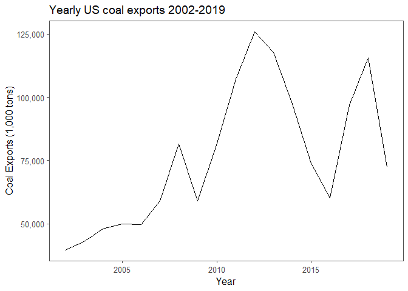
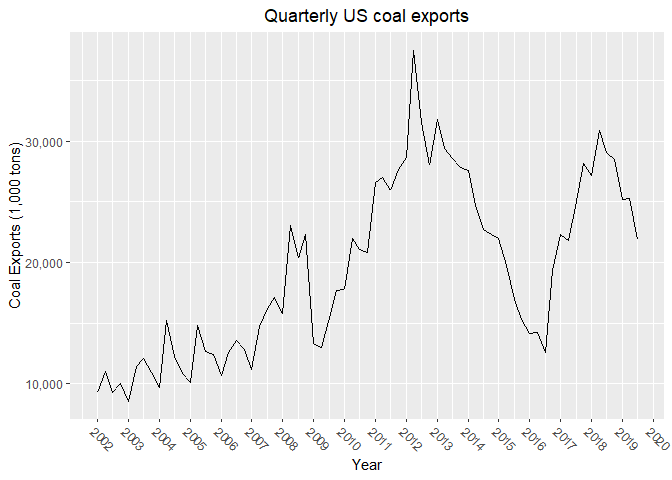
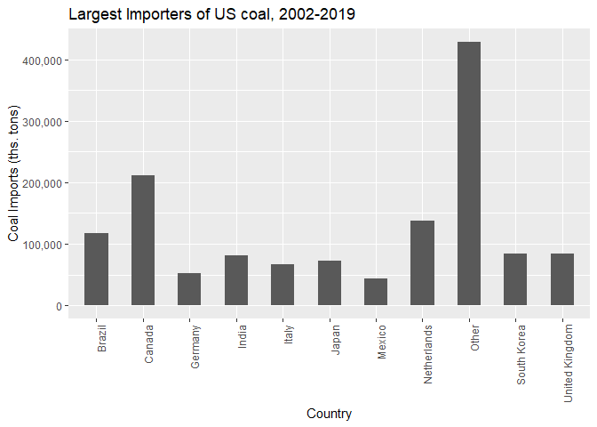
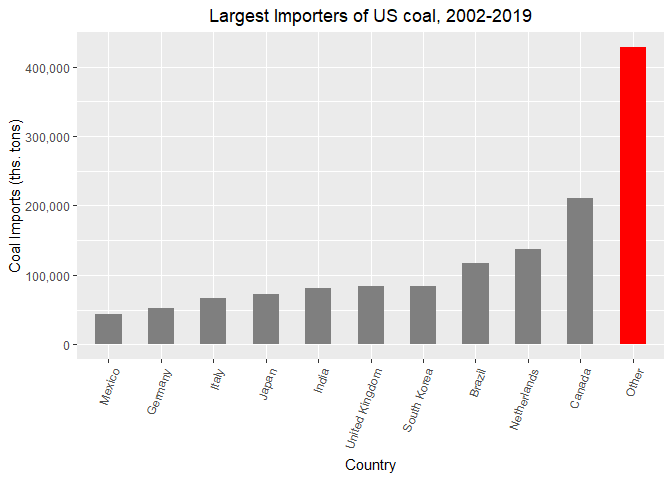
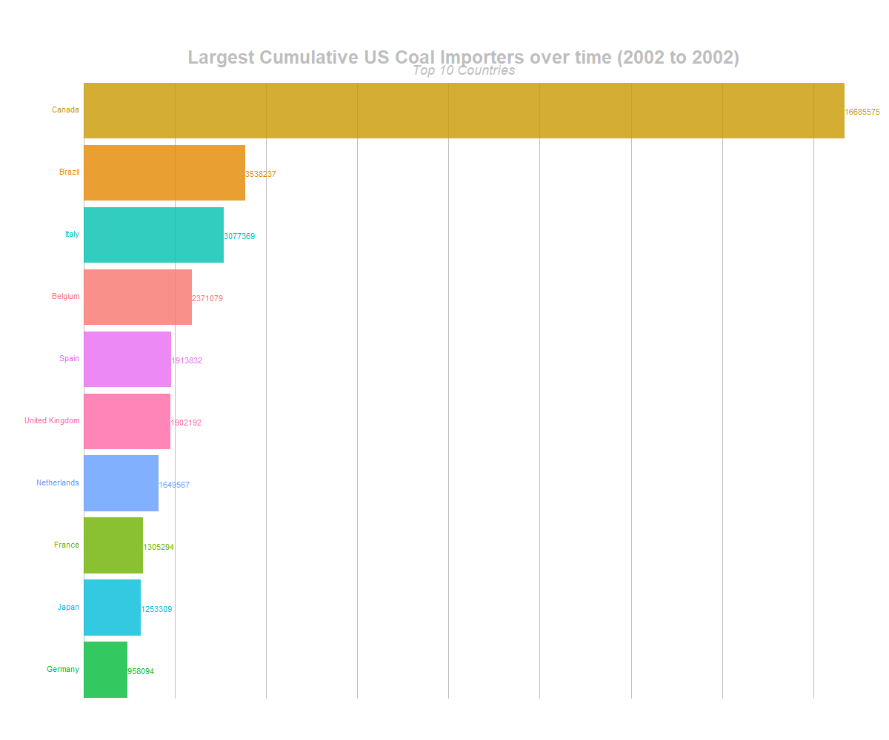
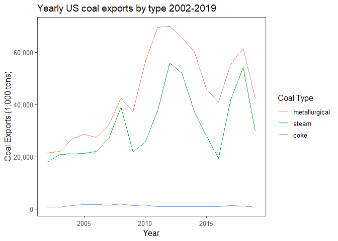

## Preliminaries: 

### Load libraries

It's a good idea to load your libraries at the top of the Rmd document so that everyone can see what you're using. Similarly, it's good practice to set `cache=FALSE` to ensure that the libraries are dynamically loaded each time you knit the document.

* Hint: These are only some of the libraries that you'll need to complete this assignment. Add more here, if and when you discover that you need them.


```r
## Install the pacman package if necessary
library(pacman)
## Install other packages using pacman::p_load()
p_load(httr,tidyverse, dplyr, ggplot2, janitor, data.table, here, readxl, lubridate,ggthemes, viridis, gganimate, gifski, png)
`%notin%` = Negate(`%in%`)
```

### Read in the data

Use `httr::GET()` to fetch the EIA excel file for us from web. (We'll learn more about `httr`, GET and other HTTP methods when we get to webscraping next week.) 


```r
# library(here) ## Already loaded
# library(httr) ## Already loaded
url <- "https://www.eia.gov/coal/archive/coal_historical_exports.xlsx"
## Only download the file if we need to
if(!file.exists(here::here("data/coal.xlsx"))) {
  httr::GET(url, write_disk(here::here("data/coal.xlsx")))
}
```

Next, we read in the file.


```r
# library(readxl) Already loaded
coal <- read_excel(here::here("/data/coal.xlsx"), skip=3, na=".")
rm(url)
```

We are now ready to go.

## 1) Clean the column names

The column (i.e. variable) names aren't great: Spacing, uppercase letters, etc. 

```r
names(coal)
```

```
##  [1] "Year"                     "Quarter"                 
##  [3] "Type"                     "Customs District"        
##  [5] "Coal Origin Country"      "Coal Destination Country"
##  [7] "Steam Coal"               "Steam Revenue"           
##  [9] "Metallurgical"            "Metallurgical Revenue"   
## [11] "Total"                    "Total Revenue"           
## [13] "Coke"                     "Coke Revenue"
```

Clean them. 


```r
coal=clean_names(coal)

names(coal)
```

```
##  [1] "year"                     "quarter"                 
##  [3] "type"                     "customs_district"        
##  [5] "coal_origin_country"      "coal_destination_country"
##  [7] "steam_coal"               "steam_revenue"           
##  [9] "metallurgical"            "metallurgical_revenue"   
## [11] "total"                    "total_revenue"           
## [13] "coke"                     "coke_revenue"
```


## 2) Total US coal exports over time (year only)

Plot the US's total coal exports over time by year ONLY. What secular trends do you notice in the data?


```r
setDT(coal)

yearly_export=coal[,.(yearly_export=sum(total, na.rm=T)),by=year]
yearly_export=yearly_export %>% mutate(year=as.Date(paste0(year,'-01-01')))


plot_year= ggplot(data= yearly_export, mapping = aes(x=year , y=yearly_export/1000))
#Total exports are in the millions of tons, so I divide by 1000 for purposes of the scale. 
plot_year+  geom_line()+
  scale_y_continuous(labels = scales::comma)+
  labs(title="Yearly US coal exports 2002-2019", x="Year", y="Coal Exports (1,000 tons)" )+
  theme(plot.title = element_text(hjust = 0.5))+
  ggthemes::theme_few()
```

<!-- -->


__The export of coal from the US experiences a net increase over the time series, but with substantial year-over-year variation, including several years with sharp declines in exports. From 2002 to 2012, exports trend upward generally, with the exception of one large downward shock right around the Great Recession.. The later portion of the time series experiences both radical upward and downward shifts in exports. __


## 3) Total US coal exports over time (year AND quarter)

Now do the same as the above, expect aggregate by quarter and year. Do you notice any seasonality that was masked from the yearly averages?


```r
setDT(coal)
coal[,year_quarter:=paste(year,quarter,sep = '.')][,year_quarter:=yq(year_quarter)]

quarterly_export=coal[,q_export:=sum(total, na.rm=T),by=year_quarter]


plot_quarter= ggplot(data= quarterly_export, mapping = aes(x=year_quarter, y=q_export/1000))
#Total exports are in the millions of tons, so I divide by 1000 for purposes of the scale. 
plot_quarter+  geom_line()+
  scale_x_date(date_labels = "%Y", date_breaks = '1 year')+
  scale_y_continuous(labels = scales::comma)+
  labs(title="Quarterly US coal exports", x="Year", y="Coal Exports (1,000 tons)" )+
  theme(plot.title = element_text(hjust = 0.5), axis.text.x=element_text(angle=-45, hjust=0.001))
```

<!-- -->

__There is evidence of seasonality in which coal exports rise in the first half of the year and then fall in the second half. This seasonality is especially evident in the first half of the time series.__


```r
rm(plot_quarter, plot_year, quarterly_export, yearly_export)
```
## 4) Exports by destination country

### 4.1) Create a new data frame

Create a new data frame called `coal_country` that aggregates total exports by destination country (and by year and quarter).


```r
setDT(coal)
coal_country=coal[,sum(total),by=.(coal_destination_country, year, quarter, year_quarter)]
names(coal_country)[5]="total_exports"
coal_country
```

```
##              coal_destination_country year quarter year_quarter total_exports
##    1: South Korea (Republic of Korea) 2002       1   2002-01-01         67088
##    2:                         Belgium 2002       1   2002-01-01        575556
##    3:                          Brazil 2002       1   2002-01-01        709171
##    4:                          Canada 2002       1   2002-01-01            NA
##    5:    Germany, Federal Republic of 2002       1   2002-01-01        236519
##   ---                                                                        
## 4354:                        Barbados 2019       3   2019-07-01            21
## 4355:                       Nicaragua 2019       3   2019-07-01            12
## 4356:                       Singapore 2019       3   2019-07-01            NA
## 4357:                        Cambodia 2019       3   2019-07-01             6
## 4358:                         Vietnam 2019       3   2019-07-01            19
```

__Please note that I have chosen to include both the year and quarter variables as well as the year_quarter variable purposely for a later question.__ 


### 4.2) Inspect the data frame

It looks like some countries are missing data for a number of years and periods (e.g. Albania). Confirm that this is the case. What do you think is happening here?


```r
coal_country %>% group_by(year, quarter) %>% count()
```

```
## # A tibble: 71 x 3
## # Groups:   year, quarter [71]
##     year quarter     n
##    <dbl>   <dbl> <int>
##  1  2002       1    46
##  2  2002       2    51
##  3  2002       3    47
##  4  2002       4    46
##  5  2003       1    47
##  6  2003       2    49
##  7  2003       3    49
##  8  2003       4    42
##  9  2004       1    51
## 10  2004       2    49
## # ... with 61 more rows
```

```r
coal_country[,.N, by=is.na(total_exports)]
```

```
##    is.na    N
## 1: FALSE 3409
## 2:  TRUE  949
```

__First of all, using the count function I can confirm that there are a different number of observations for many periods in many years. I think the most likely reason for these omissions is that some countries simply did not import coal from the US in certain years. Looking at the observations that we do have, there is a small group of countries that imported only one or two tons of coal in a given quarter of a given year. Therefore it is quite reasonable to think that in other periods, these countries imported zero tons of coal. Additionally, using data.table, I can also see that even within the set of observed exports to countries, there are many missing values. This is due to the fact that for some observations the only export is coke, not coal.__


### 4.3) Complete the data frame

Fill in the implicit missing values, so that each country has a representative row for every time year-by-quarter period. In other words, you should modify the data frame so that there are 64 rows (16 years * 4 quarters) for each country. Arrange your data by country, year and quarter. 


```r
count(unique(coal_country, by = "coal_destination_country"))
```

```
## # A tibble: 1 x 1
##       n
##   <int>
## 1   150
```

```r
150*4*18 - 150
```

```
## [1] 10650
```

__First observe that there are 150 unique countries to which the US has exported coal in our dataset. This indicates that since our dataset spans 18 years in quarterly data, but since we only have 3 quarters of data for 2019, we should have 10650 observations.__


```r
coal_country_complete=complete(data=coal_country ,coal_destination_country, year_quarter)
setDT(coal_country_complete)

coal_country_complete[,.N]
```

```
## [1] 10650
```

```r
coal_country_complete
```

```
##        coal_destination_country year_quarter year quarter total_exports
##     1:                  Albania   2002-01-01   NA      NA            NA
##     2:                  Albania   2002-04-01   NA      NA            NA
##     3:                  Albania   2002-07-01   NA      NA            NA
##     4:                  Albania   2002-10-01   NA      NA            NA
##     5:                  Albania   2003-01-01   NA      NA            NA
##    ---                                                                 
## 10646:            Western Samoa   2018-07-01   NA      NA            NA
## 10647:            Western Samoa   2018-10-01   NA      NA            NA
## 10648:            Western Samoa   2019-01-01   NA      NA            NA
## 10649:            Western Samoa   2019-04-01   NA      NA            NA
## 10650:            Western Samoa   2019-07-01   NA      NA            NA
```

__Observe that we now have the correct number of rows. Since I have included my year_quarter variable, examining the table now easily shows that each country has an entry for each quarter, and those entries corresponding to the rows which we added have been correctly filled with NA values.__

### 4.4 Some more tidying up

If you followed my hints above, you may encounter a situation where the data frame contains a quarter --- probably 2019q4 --- that is missing total export numbers for *all* countries. Did this happen to you? Filter out the completely mssing quarter if so. Also: Why do you think this might have happened? (Please answer the latter question even if it didn't happen to you.)  

__I do not believe that I have encountered this error, as I have the correct number of rows for the time series. Based on the hint you give above, I think that the most likely reason that this would occur is if one attempts to run code like this: __


```r
coal_country_complete_back_to_the_future=
  complete(data=coal_country ,coal_destination_country, year,quarter)
```
__If one were to use the lines of code above, R would generate the exact same dataset as the previous usage, but with the addition of a row for each country's 2019Q4 coal imports. This is due to the fact that we have 2019 data, and we have data from previous fourth quarters. So, completing across coal_destination_country in addition to both year and quarter as separate variables means that R will see [country, 2019, Q4] as a viable combination. The reason that my original code does not produce this error is that mine finds all unique combinations of countries observed and year-quarter pairs observed. Since we do not observe 2019Q4 data for any country in this time series, my code does not result in this error.__ 

### 4.5) Culmulative top 10 US coal export destinations

Produce a vector --- call it `coal10_culm` --- of the top 10 top coal destinations over the full 2002--2017 study period. What are they?


```r
setDT(coal)
coal_top_country=coal[,sum(total, na.rm=T),by=.(coal_destination_country)]
names(coal_top_country)[2]="total_exports"
setorder(coal_top_country,cols=-total_exports)

coal10_culm_top_names=coal_top_country[1:10,c(1)]
coal10_culm_top_names
```

```
##            coal_destination_country
##  1:                          Canada
##  2:                     Netherlands
##  3:                          Brazil
##  4: South Korea (Republic of Korea)
##  5:                  United Kingdom
##  6:                           India
##  7:                           Japan
##  8:                           Italy
##  9:    Germany, Federal Republic of
## 10:                          Mexico
```

__The top 10 countries which the US exported coal to over the whole sample are Canada, the Netherlands, Brazil, South Korea, the UK, India, Japan, Italy, Germany, and Mexico.__


### 4.6) Recent top 10 US coal export destinations

Now do the same, except for most recent period on record (i.e. final quarter in the dataset). Call this vector `coal10_recent`. Are there any interesting differences between the two vectors? Apart from any secular trends, what else might explain these differences?


```r
setDT(coal)
coal_top_country_recent=coal[year_quarter=="2019-07-01",sum(total, na.rm=T),by=.(coal_destination_country)]
names(coal_top_country_recent)[2]="total_exports_2019:Q3"
setorder(coal_top_country_recent,cols=-'total_exports_2019:Q3')
coal10_recent_top=(coal_top_country_recent[1:10,c(1)])
coal10_recent_top
```

```
##            coal_destination_country
##  1:                           Japan
##  2: South Korea (Republic of Korea)
##  3:                           India
##  4:                     Netherlands
##  5:                          Canada
##  6:                          Brazil
##  7:                         Ukraine
##  8:                           Egypt
##  9:                         Morocco
## 10:                          Mexico
```


__Several discrepancies between the two vectors are interesting. First of all, several Northern African countries make it onto the recent Top 10 list. I really am not sure what would cause these countries specifically.  Additionally, The Ukraine is on the list of recent top coal importers from the US. One potential factor why I thought this might be the case is the conflict in the Ukraine, however drilling down into the Ukranian imports from the US shows that Ukraine's import of US coal began to trend upward years before the conflict erupted. Unsurprisingly but interestingly, Germany is not on the recent top 10 list. This is unsurprising given Germany's modern commitment to green power. I just learned that the German government is slowly initiating plans to entirely phase out coal power over the next several.__

### 4.7) Plot US coal export by country

Now plot a figure that depicts coal exports dis-aggregated by country. Highlight the top 10 (cumulative) export destinations and sum the remaining countries into a combined "Other" category.


```r
coal10_culm_top=coal_top_country[1:10,.(coal_destination_country,total_exports)]
coal10_culm_other= coal_top_country[coal_destination_country %notin% as.list(t(coal10_culm_top)),.(coal_destination_country="Other", total_exports=sum(total_exports))]
coal_cumulative_exports_with_other=rbind(coal10_culm_top, coal10_culm_other)
coal_cumulative_exports_with_other[,total_exports_ths_tons:=total_exports/1000]
coal_cumulative_exports_with_other[coal_destination_country=="Germany, Federal Republic of", coal_destination_country:="Germany"]
coal_cumulative_exports_with_other[coal_destination_country=="South Korea (Republic of Korea)", coal_destination_country:="South Korea"]

coal_plot=ggplot(data=coal_cumulative_exports_with_other, aes(x=coal_destination_country, y=total_exports_ths_tons))
coal_plot +
  geom_bar(stat="identity", width=0.5)+
  scale_y_continuous(labels = scales::comma)+
  labs(title="Largest Importers of US coal, 2002-2019", x="Country", y="Coal Imports (ths. tons)" )+
  theme(axis.text.x = element_text(angle = 90, hjust = 1))
```

<!-- -->


### 4.8) Make it pretty

Take your previous plot and add some swag to it. That is, try to make it as visually appealing as possible without overloading it with chart junk.


```r
coal_plot_2=ggplot(data=coal_cumulative_exports_with_other, aes(x=reorder(coal_destination_country, total_exports_ths_tons),y=  total_exports_ths_tons,fill=factor(ifelse(coal_destination_country=="Other","Highlighted","Normal"))))

coal_plot_2 +
  geom_bar(stat="identity", width=0.5, show.legend=F)+
  theme(axis.text.x = element_text(angle = 70, hjust = 1), plot.title = element_text(hjust = 0.5))+
    scale_y_continuous(labels = scales::comma)+
  scale_fill_manual(name = "coal_destination_country", values=c("red","grey50"))+
   labs(title="Largest Importers of US coal, 2002-2019", x="Country", y="Coal Imports (ths. tons)" )
```

<!-- -->


### 4.9) Make it interactive

Create an interactive version of your previous figure.

```r
coal_country_to_2002=coal[year %in% c(2002:2002),sum(total,na.rm=T),by=.(coal_destination_country)][,":="(total_exports=V1)][,.(coal_destination_country,total_exports)][order(-total_exports), .SD[1:10]][,rank:=rank(-total_exports)][,year:=2002]
coal_country_to_2003=coal[year %in% c(2002:2003),sum(total,na.rm=T),by=.(coal_destination_country)][,":="(total_exports=V1)][,.(coal_destination_country,total_exports)][order(-total_exports), .SD[1:10]][,rank:=rank(-total_exports)][,year:=2003]
coal_country_to_2004=coal[year %in% c(2002:2004),sum(total,na.rm=T),by=.(coal_destination_country)][,":="(total_exports=V1)][,.(coal_destination_country,total_exports)][order(-total_exports), .SD[1:10]][,rank:=rank(-total_exports)][,year:=2004]
coal_country_to_2005=coal[year %in% c(2002:2005),sum(total,na.rm=T),by=.(coal_destination_country)][,":="(total_exports=V1)][,.(coal_destination_country,total_exports)][order(-total_exports), .SD[1:10]][,rank:=rank(-total_exports)][,year:=2005]
coal_country_to_2006=coal[year %in% c(2002:2006),sum(total,na.rm=T),by=.(coal_destination_country)][,":="(total_exports=V1)][,.(coal_destination_country,total_exports)][order(-total_exports), .SD[1:10]][,rank:=rank(-total_exports)][,year:=2006]
coal_country_to_2007=coal[year %in% c(2002:2007),sum(total,na.rm=T),by=.(coal_destination_country)][,":="(total_exports=V1)][,.(coal_destination_country,total_exports)][order(-total_exports), .SD[1:10]][,rank:=rank(-total_exports)][,year:=2007]
coal_country_to_2008=coal[year %in% c(2002:2008),sum(total,na.rm=T),by=.(coal_destination_country)][,":="(total_exports=V1)][,.(coal_destination_country,total_exports)][order(-total_exports), .SD[1:10]][,rank:=rank(-total_exports)][,year:=2008]
coal_country_to_2009=coal[year %in% c(2002:2009),sum(total,na.rm=T),by=.(coal_destination_country)][,":="(total_exports=V1)][,.(coal_destination_country,total_exports)][order(-total_exports), .SD[1:10]][,rank:=rank(-total_exports)][,year:=2009]
coal_country_to_2010=coal[year %in% c(2002:2010),sum(total,na.rm=T),by=.(coal_destination_country)][,":="(total_exports=V1)][,.(coal_destination_country,total_exports)][order(-total_exports), .SD[1:10]][,rank:=rank(-total_exports)][,year:=2010]
coal_country_to_2011=coal[year %in% c(2002:2011),sum(total,na.rm=T),by=.(coal_destination_country)][,":="(total_exports=V1)][,.(coal_destination_country,total_exports)][order(-total_exports), .SD[1:10]][,rank:=rank(-total_exports)][,year:=2011]
coal_country_to_2012=coal[year %in% c(2002:2012),sum(total,na.rm=T),by=.(coal_destination_country)][,":="(total_exports=V1)][,.(coal_destination_country,total_exports)][order(-total_exports), .SD[1:10]][,rank:=rank(-total_exports)][,year:=2012]
coal_country_to_2013=coal[year %in% c(2002:2013),sum(total,na.rm=T),by=.(coal_destination_country)][,":="(total_exports=V1)][,.(coal_destination_country,total_exports)][order(-total_exports), .SD[1:10]][,rank:=rank(-total_exports)][,year:=2013]
coal_country_to_2014=coal[year %in% c(2002:2014),sum(total,na.rm=T),by=.(coal_destination_country)][,":="(total_exports=V1)][,.(coal_destination_country,total_exports)][order(-total_exports), .SD[1:10]][,rank:=rank(-total_exports)][,year:=2014]
coal_country_to_2015=coal[year %in% c(2002:2015),sum(total,na.rm=T),by=.(coal_destination_country)][,":="(total_exports=V1)][,.(coal_destination_country,total_exports)][order(-total_exports), .SD[1:10]][,rank:=rank(-total_exports)][,year:=2015]
coal_country_to_2016=coal[year %in% c(2002:2016),sum(total,na.rm=T),by=.(coal_destination_country)][,":="(total_exports=V1)][,.(coal_destination_country,total_exports)][order(-total_exports), .SD[1:10]][,rank:=rank(-total_exports)][,year:=2016]
coal_country_to_2017=coal[year %in% c(2002:2017),sum(total,na.rm=T),by=.(coal_destination_country)][,":="(total_exports=V1)][,.(coal_destination_country,total_exports)][order(-total_exports), .SD[1:10]][,rank:=rank(-total_exports)][,year:=2017]
coal_country_to_2018=coal[year %in% c(2002:2018),sum(total,na.rm=T),by=.(coal_destination_country)][,":="(total_exports=V1)][,.(coal_destination_country,total_exports)][order(-total_exports), .SD[1:10]][,rank:=rank(-total_exports)][,year:=2018]
coal_country_to_2019=coal[year %in% c(2002:2019),sum(total,na.rm=T),by=.(coal_destination_country)][,":="(total_exports=V1)][,.(coal_destination_country,total_exports)][order(-total_exports), .SD[1:10]][,rank:=rank(-total_exports)][,year:=2019]

import_ranks_series=rbind(coal_country_to_2002,coal_country_to_2003,coal_country_to_2004,coal_country_to_2005,coal_country_to_2006,coal_country_to_2007,coal_country_to_2008,coal_country_to_2009,coal_country_to_2010,coal_country_to_2011,coal_country_to_2012,coal_country_to_2013,coal_country_to_2014,coal_country_to_2015,coal_country_to_2016,coal_country_to_2017,coal_country_to_2018,coal_country_to_2019)
names(import_ranks_series)[1]="country"

import_ranks_series[country=="Germany, Federal Republic of", country:="Germany"]
import_ranks_series[country=="South Korea (Republic of Korea)", country:="South Korea"]
 rm(coal_country_to_2002,coal_country_to_2003,coal_country_to_2004,coal_country_to_2005,coal_country_to_2006,coal_country_to_2007,coal_country_to_2008,coal_country_to_2009,coal_country_to_2010,coal_country_to_2011,coal_country_to_2012,coal_country_to_2013,coal_country_to_2014,coal_country_to_2015,coal_country_to_2016,coal_country_to_2017,coal_country_to_2018,coal_country_to_2019)

anim <- ggplot(import_ranks_series, aes(rank, group = country, 
                fill = as.factor(country), color = as.factor(country))) +
 geom_tile(aes(y = total_exports/2,
                height = total_exports,
                 width = 0.9), alpha = 0.8, color = NA) +
   geom_text(aes(y = 0, label = paste(country, " ")), vjust = 0.2, hjust = 1) +
   geom_text(aes(y=total_exports,label = total_exports, hjust=0)) +
   coord_flip(clip = "off", expand = FALSE) +
   scale_y_continuous(labels = scales::comma) +
   scale_x_reverse() +
   guides(color = FALSE, fill = FALSE) +
   theme(axis.line=element_blank(),
         axis.text.x=element_blank(),
         axis.text.y=element_blank(),
         axis.ticks=element_blank(),
         axis.title.x=element_blank(),
          axis.title.y=element_blank(),
         legend.position="none",
         panel.background=element_blank(),
         panel.border=element_blank(),
         panel.grid.major=element_blank(),
         panel.grid.minor=element_blank(),
         panel.grid.major.x = element_line( size=.1, color="grey" ),
         panel.grid.minor.x = element_line( size=.1, color="grey" ),
         plot.title=element_text(size=25, hjust=0.5, face="bold", colour="grey", vjust=-1),
         plot.subtitle=element_text(size=18, hjust=0.5, face="italic", color="grey"),
         plot.caption =element_text(size=8, hjust=0.5, face="italic", color="grey"),
         plot.background=element_blank(),
        plot.margin = margin(2,2, 2, 4, "cm")) +
   transition_states(year, transition_length = 4, state_length = 1) +
   view_follow(fixed_x = TRUE)  +
   labs(title = 'Largest Cumulative US Coal Importers over time (2002 to {closest_state})',  
        subtitle  =  "Top 10 Countries")

animate(anim, 200, fps = 20,  width = 1200, height = 1000, 
        renderer = gifski_renderer("coalimport.gif")) 
```

<!-- -->

*Hint: Take a look at plotly::ggplotly(), or the gganimate package.*


There's a lot still to explore with this data set. Your final task is to show me something interesting. Drill down into the data and explain what's driving the secular trends that we have observed above. Or highlight interesting seasonality within a particular country. Or go back to the original `coal` data frame and look at exports by customs district, or by coal type. Do we changes or trends there? Etcetera. Etcetera. My only requirement is that you show your work and tell me what you have found.


```r
type_totals=coal[,.(metallurgical=sum(metallurgical, na.rm = T), steam=sum(steam_coal, na.rm = T), coke=sum(coke, na.rm = T)), by=year]

type_totals_melt=melt(type_totals,id.vars = 1)
names(type_totals_melt)=c("year","coal_type", "total")


type_plot=ggplot(data=type_totals_melt, aes(year, y=total/1000, group=coal_type, color=coal_type))


type_plot+
  geom_line()+
    scale_y_continuous(labels = scales::comma)+
    labs(title="Yearly US coal exports by type 2002-2019", x="Year", y="Coal Exports (1,000 tons)" )+
    scale_colour_discrete(name  ="Coal Type")+
    theme( plot.title = element_text(hjust = 0.5))+
  theme_few()
```

<!-- -->
__One interesting find in this dataset is the difference between the types of coal found in US export trends. First of all, both metallurgical and steam coal exhibit the same secular trend. This is mildly interesting in itself, since while they are both 'coal', metallurgical coal is used in the production and refinement of metals, while steam coal is used to generate the heat the powers steam turbines in coal-fired power plants. What is more interesting, though, is the difference between the secular trend in metallurgical coal and that of coke. Coke is not technically coal, but is rather a refinement of coal used in the refinement of metals. Notably, though, the primary use of metallurgical coal is to be turned into coke to be used in the refinement of metals. Thus, I find it very interesting that coke exports exhibit almost no export trend for the duration of our time series. __
